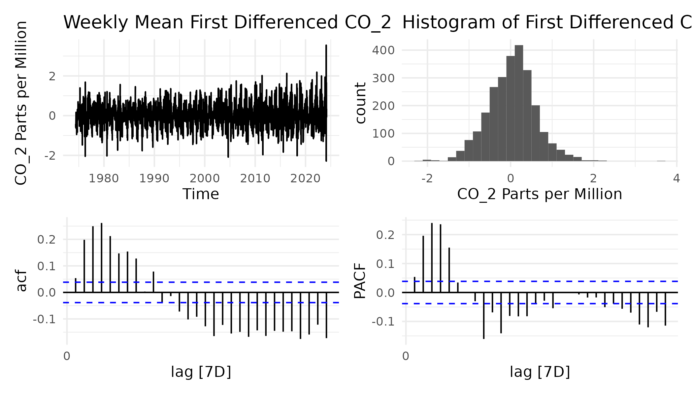

---
title: "The Evolution of CO2 Levels from 1997 to Present"
author: "by Qiong Zhang, Ruiyu Zhou, Tejas Shirshikar, and Maria Lee"
output: pdf_document
header-includes:
   - \usepackage{ulem}
   - \usepackage{float}
---

```{r setup, include=FALSE, warning=FALSE, message=FALSE}
knitr::opts_chunk$set(echo = TRUE)
```

```{r load packages, message=FALSE, warning=FALSE,include=F}
library(tidyverse)
library(patchwork) 

library(lubridate)
library(datasets)

library(tsibble)
library(feasts)
library(forecast)

library(sandwich)
library(lmtest)
library(ggfortify)
library(nycflights13)
library(blsR)
library(ggplot2)

## Forecasting Models for Tidy Time Series
library(fable)
## To assemble multiple plots
library(gridExtra)
## for simulations 
## To use TeX() to write expression in the title of plots
library(latex2exp)
library(stargazer)
```

```{r set themes,include=F, echo = FALSE}
theme_set(theme_minimal())
```

```{=tex}
\begin{center} \textbf{I. Background} \end{center}
\begin{center} \textit{A. The Keeling Curve} \end{center}
```
In the late 1950's, Charles Keeling initiated groundbreaking scientific endeavor, systematically measuring atmospheric carbon dioxide ($CO_2$) levels in Mauna Loa, Hawaii (1). This work unveiled a striking pattern in the $CO_2$ data, contradictory to the previous publications pointing to high variability (1)(2). Now known as the Keeling Curve, these findings have become an important reference in climate science, offering crucial evidence of the rapid changes occuring in our planet's atmosphere due to human activities.

```{=tex}
\begin{center} \textit{B. Analyzing Trends in CO2 data: Significance and Evolution} \end{center}
```
Centering our analysis on the critical question of \textit{What trends can be identified in the $CO_2$ data up to 1998, and what do they indicate about global environmental changes?} The investigation into seasonal fluctuations and the long-term increase in CO2 concentrations aimed to unravel insights into both the natural cycle affecting our climate system and the anthropogenic impacts stemming from increase fossil fuel combustion and agricultural activities(2).

The continuation of this analysis brings forth a pressing question: \textit{How accurately have the models we utilized in the data up to 1997 predicted the $CO_2$ levels measured in the following years?} This inquiry probes not only the precision of our forecasts but also delves into whether any discrepancies highlight limitations within our models.

```{=tex}
\begin{center} \textit{C. Technological and Methodological Advancements since 1997} \end{center}
```
Since 1997, significant advancements occurred in the data generating process for measuring $CO_2$ levels at the Mauna Loa Observatory. The adaptation of a new $CO_2$ analyzer, Cavity Ring-Down Spectroscopy (CRDS) technology, in April 2019 was a pivotal upgrade, replacing the previous infrared absorption-based analyzer. Calibration methods also evolved, with meticulous control of temperature, pressure, and flow rate, along with frequent calibrations using reference gas mixtures. Furthermore, detailed data selection criteria have been implemented to identify background air, which aimed to eliminate local influences on $CO_2$ measurements (3). In addition to the advancements, there was a disruption in measurements from November 2022 to July 2023 due to the eruption of the Mauna Loa Volcano, during which observations were conducted from the Maunakea Observatories approximately 21 miles north of the Mauna Loa Observatory. However, observations at Mauna Loa resumed in July 2023, ensuring continuity in the long-term $CO_2$ monitoring efforts (4).

```{=tex}
\begin{center} \textit{D. Aims and Implications of Continued Analysis} \end{center}
```
As we extend our analysis into the present, our aim is not only to validate past predictions but also contribute to a deeper understanding of $CO_2$ impacts on Earth. This ongoing investigation serves as both a reflection on past observations and a forward-looking lens into future climate scenarios.

```{=tex}
\begin{center} \textbf{II. Measurement and Data} \end{center}
\begin{center} \textit{A. Measuring Atmospheric Carbon} \end{center}
```
This analysis begins with a meticulous measurement of atmospheric carbon dioxide levels, generated at the Mauna Loa Observatory. Located at a high elevation of 3,400 meters at near the summit of the Mauna Loa volcano in Hawaii, this observatory is situated far from significant urban pollution sources and vegetative influences, providing an optimal setting for gathering representative samples of the global atmosphere. $CO_2$ measurements are collected by measuring the mole fraction of $CO_2$ in dry air and the new CRDS technology mentioned earlier, measures the rate of light absorption in an optical cavity rather than the magnitude of absorption, offering enhanced precision (3).

```{=tex}
\begin{center} \textit{B. Historical Trends} \end{center}
```
In the left top panel of Figure 1, the time series plot of $CO_2$ concentrations up to 1997 clearly indicates a robust and consistent trend as well as seasonality within the monthly mean $CO_2$ data. This steady rise indicates the cumulative impact of human activities, primarily the burning of fossil fuels, which is corroborated by the histogram in the top-right panel. The histogram reveals the distribution of CO2 measurements, with most data points clustering around the higher end of the scale as time progresses, which supports the trend observed in the time series plot. The ACF plot in the bottom-left panel displays significant and sustained autocorrelation across numerous time lags, which denotes the presence of seasonality within the data. This seasonality is evidenced by the regular oscillations in $CO_2$ levels due to the cyclical nature of plant growth and decay, especially prominent in the northern hemisphere with its larger landmass and extensive vegetation (2). Lastly, the PACF plot in the bottom-right panel presents a first lag yielding a value of 1, indicating the present of a unit root within the series.

```{r fig1, echo=FALSE, fig.pos='H', fig.cap="1997 CO2"}
knitr::include_graphics("originaltrend.plot.png")
```

To further investigate this, first-differences $CO_2$ was analyzed to check the stationarity. In Figure 2, we see the elimination of the long-term trend, exposing the underlying seasonality more clearly. Which is further supported by periodic oscillations in the ACF plot. Significant lags for non-seasonal MA terms are observed, along with potential indications of seasonal MA terms. The PACF suggests the presence of non-seasonal and seasonal AR lags. To formally assess the stationarity of the differenced series, a KPSS root test was performed. The results from the KPSS test, with a p-value of 0.1 indicate that the null hypothesis of stationarity cannot be rejected, supporting the conclusion that the first differencing of the $CO_2$ series was necessary to achieve a stationary time series.

```{r fig2, echo=FALSE, fig.pos='H', fig.cap="1997 CO_2 First Difference."}
knitr::include_graphics("differenced.plot.png")
```

The decomposition analysis in Figure 3, reflecting the persistent rise in $CO_2$ levels, alongside regular seasonal patterns that show no change in magnitude over time. The first differencing of the data confirms these findings, indicating stable month-to-month variations once the trend is removed.

```{r fig3, echo=FALSE, out.width = '48%', fig.show = 'hold', fig.pos='H', fig.cap="Decomposed CO2 and First Difference CO2 time series"}

knitr::include_graphics("dcmp_co2_1d_plot.png")
```

Percentage growth rate assessment, indicates a steady increase in atmospheric concentrations, consistently below 0.8% annually. Despite appearing small, this percentage represents a meaningful and compounding rise in $CO_2$ levels, indicative of an accelerating trend with significant long-term implications.

```{r fig4, echo=FALSE, fig.width= 6, out.width = '68%', fig.height= 4, fig.pos='H', fig.cap="Percentage Growth Rate Assessment"}

```

```{r 1a.1 Original Dataset Transformations,include=F}
# Load the CO2 dataset
data("co2")

# View the structure of the CO2 dataset
str(co2)

# Create a dataframe with co2 and date columns
co2_df <- data.frame(co2)
dates <- seq(as.Date("1959-01-01"), by = "month", length.out = length(co2))

# Format the dates to extract the month and year in "YYYY-MM" format
co2_df$monthyear <- format(dates, "%Y-%m")

# Convert to ts series
co2_df <- co2_df %>% 
  mutate(time_index = yearmonth(monthyear)) %>% # convert the date to year-month format
  as_tsibble(index = time_index) # create time series 

head(co2_df)
frequency(co2_df)
frequency(co2_df$time_index)
```

```{r 1a.2, fig.width = 7, fig.height = 5, fig.align = 'center', warning = F, include = F, echo = FALSE, message = F}
# Time plot
timeplot_co2 <- co2_df %>%
  ggplot() +
  aes(x=time_index, y=co2) +
  geom_line() +
  labs(
    title = "Monthly Mean CO_2",
    x = "Month and Year",
    y = "CO_2 Parts per Million"
  )

# Histogram
hist_co2 <- co2_df %>%
  ggplot() +
  geom_histogram(aes(x = co2)) +
  labs(
    title = "Histogram of CO_2",
    x = "CO_2 Parts per Million"
  ) +
  theme(legend.position = c(.2, .8))

# ACF Plot
acf_co2 <- co2_df%>%
  ACF(y=co2) %>%
  autoplot()

# PACF Plot
pacf_co2 <- co2_df %>%
  ACF(y=co2, type = "partial") %>%
  autoplot() +
  labs(y = "PACF")

originaltrend.plot <- (timeplot_co2 + hist_co2) /
  (acf_co2 + pacf_co2)
ggsave("originaltrend.plot.png", plot = originaltrend.plot, width = 7, height = 4)
```

```{r, 1a.3 first diff kpss, include=F}
co2_df%>%
  mutate(diff_co2=difference(co2))%>%
  features(diff_co2, unitroot_kpss)
```

```{r, 1a.4 first diff, fig.width = 7, fig.height = 5, fig.align = 'center', warning = F, include=F, echo = FALSE}
# First differencing of co2
timeplot_co2_1d <- co2_df %>%
  ggplot() +
  aes(x=time_index, y=difference(co2)) +
  geom_line() +
  labs(
    title = "1st Diff Monthly Mean CO_2",
    x = "Time Index",
    y = "1st Diff of Monthly Mean CO_2"
  )

# First differencing histogram
hist_co2_1d <- co2_df %>%
  ggplot() +
  geom_histogram(aes(x = difference(co2))) +
  labs(
    title = "1st Diff CO_2 Histogram",
    x = "1st Diff CO_2"
  ) +
  theme(legend.position = c(.2, .8))

# First differencing ACF
acf_co2_1d <- co2_df %>%
  ACF(y=difference(co2)) %>%
  autoplot()

# First differencing PACF
pacf_co2_1d <- co2_df %>%
  ACF(y=difference(co2), type = "partial") %>%
  autoplot()

differenced.plot<- (timeplot_co2_1d + hist_co2_1d) /
  (acf_co2_1d + pacf_co2_1d)
ggsave("differenced.plot.png", plot = differenced.plot, width = 7, height = 4)
```

```{r, 1a.5 first diff kpss-1, include=F}
co2_df%>%
  mutate(diff_co2=difference(co2))%>%
  features(diff_co2, unitroot_kpss)
```

```{r, 1a.6 decomposition1, fig.width = 6, fig.height = 4, fig.align = 'center', warning = F, include = F, message = F}
dcmp_co2 <- decompose(co2)
dcmp_co2_1d <- decompose(diff(co2))
png("dcmp_co2_plot.png", width = 350, height = 300)
plot(dcmp_co2)
dev.off()
png("dcmp_co2_1d_plot.png", width = 350, height = 300)
plot(dcmp_co2_1d)
dev.off()

```

```{r, 1a.7, fig.width = 7, fig.height = 5, fig.align = 'center', warning = F, echo = FALSE, message = F, include = F}
co2_df$trend <- dcmp_co2$trend
co2_df %>%
autoplot(co2, color = "grey") +
geom_line(data = co2_df, 
          aes(x = time_index, y = trend, color = "Trend"))+
  labs(title = expression(Trend~of~Monthly~Mean~CO[2]), 
       y = "CO2 Parts per Million",
       x = "Month and Year")
```

```{r 1a.8, fig.width = 7, fig.height = 4, fig.align = 'center', warning = F, message = F, echo = F, include = F}
co2_df_growth <- co2_df
co2_df_growth$year <- year(co2_df_growth$time_index)

co2_df_anuual_growth <- co2_df_growth %>%
  group_by(year) %>%
  slice(n())

co2_df_anuual_growth$lag_co2 <- lag(co2_df_anuual_growth$co2, 1)

co2_df_anuual_growth$growth_rate_pct <- (co2_df_anuual_growth$co2 / co2_df_anuual_growth$lag_co2 - 1) * 100
co2_df_anuual_growth$growth_rate_log <- log(co2_df_anuual_growth$co2 / co2_df_anuual_growth$lag_co2) * 100

co2_growth_rate_pct <- 
  ggplot(co2_df_anuual_growth, aes(x = time_index, y = growth_rate_pct)) +
  geom_line() +
  geom_smooth(method = "loess", se = TRUE, color = "blue", fill = "lightblue") +
  labs(title = "Percentage Growth Rate of CO2",
       x = "Date",
       y = "Growth Rate (%)")

co2_growth_rate_log <- 
  ggplot(co2_df_anuual_growth, aes(x = time_index, y = growth_rate_log)) +
  geom_line() +
  geom_smooth(method = "loess", se = TRUE, color = "blue", fill = "lightblue") +
  labs(title = "Log Growth Rate of CO2",
       x = "Date",
       y = "Growth Rate (%)")

p.growthrate <- co2_growth_rate_pct 
ggsave("p.growthrate.png", plot = p.growthrate, width = 7, height = 4)
#co2_growth_rate_log
```

```{=tex}
\begin{center} \textit{C. Present Trends} \end{center}
```
When assessing the evolution of the Keeling Curve from 1997 to the present, we continue to observe a pronounced upward trend in CO2 levels, echoing the patterns identified in the earlier data. The ACF and PACF plots display sustained autocorrelation and the presence of a unit root, respectively, consistent with the historical analysis which necessitated differencing to achieve stationarity. The KPSS test corroborates this, with a p-value indicating stationarity in the differenced series. These findings confirm the ongoing influence of human activities on CO2 concentrations, with the percentage growth rate analysis further highlighting a compounding rise in levels, maintaining a rate below 0.8% annually. This persistence of trends and seasonality from the 1997 data to the present underscores the unrelenting trajectory of CO2 accumulation in the atmosphere.

```{r fig5, echo=FALSE, out.width = '53%', fig.show = 'hold', fig.pos='H', fig.cap="Present CO2 and First Differenced"}


```

The time series decomposition graphs illustrate the transformation from non-stationary to stationary data. The original dataset depicts an upward trend, signifying non-stationarity, with clear seasonality and considerable random fluctuations. Post differencing, the trend component is neutralized, evidencing stationarity with a consistent mean. The seasonal patterns remain unchanged, indicating their persistence regardless of stationarity. The random component, though still volatile, is now centered around zero without a discernible trend, characterizing the achieved stationarity.

```{r 1b.1 Data pipeline and reading data, message = F, include = F, echo=F}
# Website went down 
co2_present<-read.csv("https://gml.noaa.gov/webdata/ccgg/trends/co2/co2_weekly_mlo.csv", header=T, sep=",", quote = "\"", dec = ".", fill = TRUE, comment.char = "#")
#co2_present <- read.csv("co2_weekly_mlo.csv", skip = 35, header = TRUE)
#co2_present[1:4, ]
#class(co2_present)
```

```{r 1b.2 EDA - dataset manipulation, include = F, echo=F}
# Create a Date column from year, month, day - duplicates when only monthyear since its weekly data
co2_present$date <- as.Date(with(co2_present, paste(year, month, day, sep="-")), "%Y-%m-%d")
co2_present$time_index <- co2_present$date

# Convert to Time Series
co2_present <- co2_present %>%
  as_tsibble(index = time_index)
co2_present[1:5, ]

# Unknown values are indicated as -999.99.
# Counting number of -999.99 in each column
counts_NA <- list()
for (col_name in names(co2_present)) {
  counts_NA[[col_name]] <- sum(co2_present[[col_name]] == -999.99, na.rm = TRUE)
}
df_counts_NA <- as.data.frame(counts_NA, row.names = "Count_of_Neg999.99")
print(df_counts_NA)

# Mutating -999.99 in all columns to NA 
co2_present <- co2_present %>%
  mutate(across(c(average, X1.year.ago, X10.years.ago, increase.since.1800), ~na_if(.x, -999.99)))
```

```{r 1b.3 EDA - plots, warning = F, include = F, echo=F}
# Time plot
timeplot_co2.p <- co2_present %>%
  ggplot() +
  aes(x=time_index, y=average) +
  geom_line() +
  labs(
    title = "Weekly Mean CO_2",
    x = "Time",
    y = "CO_2 Parts per Million"
  )

# Histogram
hist_co2.p <- co2_present %>%
  ggplot() +
  geom_histogram(aes(x = average)) +
  labs(
    title = "Histogram of CO_2",
    x = "CO_2 Parts per Million"
  ) +
  theme(legend.position = c(.2, .8))

# ACF Plot
acf_co2.p <- co2_present%>%
  ACF(y=average) %>%
  autoplot()

# PACF Plot
pacf_co2.p <- co2_present %>%
  ACF(y=average, type = "partial") %>%
  autoplot() +
  labs(y = "PACF")

present.ts.plot <- (timeplot_co2.p + hist_co2.p) /
  (acf_co2.p + pacf_co2.p)
ggsave("present.ts.plot.png", plot = present.ts.plot, width = 7, height = 4)
```

```{r 1b.4 EDA - plots diff, warning = F, include = F, echo=F}
# Time plot
timeplot_co2_1d.p <- co2_present %>%
  ggplot() +
  aes(x=time_index, y=difference(average)) +
  geom_line() +
  labs(
    title = "Weekly Mean First Differenced CO_2",
    x = "Time",
    y = "CO_2 Parts per Million"
  )

# Histogram
hist_co2_1d.p <- co2_present %>%
  ggplot() +
  geom_histogram(aes(x = difference(average))) +
  labs(
    title = "Histogram of First Differenced CO_2",
    x = "CO_2 Parts per Million"
  ) +
  theme(legend.position = c(.2, .8))

# ACF Plot
acf_co2_1d.p <- co2_present%>%
  ACF(y=difference(average)) %>%
  autoplot()

# PACF Plot
pacf_co2_1d.p <- co2_present %>%
  ACF(y=difference(average), type = "partial") %>%
  autoplot() +
  labs(y = "PACF")

present.ts.diff.plot <- (timeplot_co2_1d.p + hist_co2_1d.p) /
  (acf_co2_1d.p + pacf_co2_1d.p)
ggsave("present.ts.diff.plot.png", plot = present.ts.diff.plot, width = 7, height = 4)
```

```{r 1b.5 EDA - KPSS original data, include = F, echo=F}
co2_kpss<- co2_present %>%
  # Have to filter out any NAs before performing the KPSS test
  filter(!is.na(average)) %>%
  features(average, unitroot_kpss)
print(co2_kpss)
```

```{r 1b.6 EDA - KPSS differencing data, include= F, echo=F}
# Differencing the data
co2_differenced <- co2_present %>%
  mutate(diff_average = difference(average))

co2_kpss_diff_results <- co2_differenced %>%
  features(diff_average, unitroot_kpss)
print(co2_kpss_diff_results)
```

```{r 1b.7 EDA - classical decomposition: original and differenced data, include = F, echo=F}
# Omitting NAs for decomposition
co2_mod <- co2_present %>%
  mutate(average = na.approx(average, na.rm = FALSE))
class(co2_mod)
print(co2_mod)

# Classical Decomposition
co2_mod.ts <- ts(co2_mod$average, frequency = 52, start = c(1974, (as.numeric(format(min(co2_mod$date), "%j"))-1)/7 + 1))
class(co2_mod.ts)
co2_decomp <- decompose(co2_mod.ts, type = "additive")
plot(co2_decomp)

# Differenced data
diff_average_vector <- na.omit(co2_differenced$diff_average)
diff_average_ts <- ts(diff_average_vector, frequency = 52, start = c(1974, 2))
# Classical Decomposition
diff_average_decomp <- decompose(diff_average_ts, type = "additive")
plot(diff_average_decomp)
```

```{r 1b.8 EDA - STL decomposition, include = F, echo=F}
# Log transformation to average for STL
co2_mod <- co2_mod %>%
  as_tsibble(index = time_index)
co2_log_transformed <- co2_mod %>%
  mutate(log_average = log(average))

co2_log_transformed <- co2_log_transformed %>%
  mutate(time_index = as.Date(time_index)) %>%
  as_tsibble(index = time_index)

# STL decomposition
co2_stl <- co2_log_transformed %>%
  model(STL(log_average ~ season(window = "periodic")))
co2_components <- components(co2_stl)
autoplot(co2_components)
```

```{r 1b.9 EDA - 5 year moving average growth rate, warning = F, include = F, echo=F}
# Calculating the average of the averages by each year
co2_annual_averages <- co2_present %>%
  index_by(year = year(time_index)) %>%
  summarise(annual_average = mean(average, na.rm = TRUE))

# Calculate the percentage growth rate based on the annual averages
co2_annual_averages <- co2_annual_averages %>%
  mutate(
    lag_annual_average = lag(annual_average),  # Lag
    Percentage_Growth_Rate = (annual_average - lag_annual_average) / lag_annual_average * 100
  ) %>%
  filter(!is.na(Percentage_Growth_Rate))

# Moving Average - 5 years
co2_annual_averages <- co2_annual_averages %>%
  mutate(
    Moving_Average_Growth_Rate = rollapply(Percentage_Growth_Rate, width = 5, FUN = mean, fill = NA, align = 'center', na.rm = TRUE)
  )

co2_growth_plot <- ggplot(co2_annual_averages, aes(x = year, y = Moving_Average_Growth_Rate)) +
  geom_line(color = "blue", na.rm = TRUE, show.legend = TRUE) +  
  geom_smooth(method = "loess", se = TRUE, color = "red", fill = 'lightblue', show.legend = TRUE) +  
  labs(title = "5-Year Moving Average Growth Rate of CO2 Levels",
       x = "Year",
       y = "5-Year Moving Avg Growth Rate (%)") +
  theme_minimal()

co2_growth_plot
ggsave("co2_growth_plot.png", plot = co2_growth_plot, width = 7, height = 4)
```

```{r 1b.10, create monthly data, include = F, echo=F}
# Create a dataframe showing the monthly mean co2
monthly_mean_co2 <- co2_present[(!is.na(co2_present$average))
                                & (co2_present$year>1997), ] %>% 
  group_by(year, month) %>%
  index_by(monthyear = yearmonth(time_index)) %>%
  summarize(co2 = mean(average))

# Check the count
monthly_mean_co2[, c("year", "month")] %>% 
  group_by(year) %>%
  summarise(count = n())
colSums(is.na(monthly_mean_co2))

# Create a tsibble dataframe
monthly_mean_co2_df <- data.frame(monthyear  = monthly_mean_co2$monthyear, 
                                  year = monthly_mean_co2$year, 
                                  month = monthly_mean_co2$month, 
                                  co2 = monthly_mean_co2$co2)

# Convert it time series
monthly_mean_co2_df <- monthly_mean_co2_df %>%
  mutate(time_index = monthyear) %>%
  as_tsibble(index = time_index) 

class(monthly_mean_co2_df)

# Spot check
head(monthly_mean_co2_df)
frequency(monthly_mean_co2_df$time_index)
frequency(monthly_mean_co2_df)

# Time plot
monthly_mean_co2_df %>%
  ggplot() +
  aes(x=time_index, y=co2) +
  geom_line() +
  labs(
    title = "Actual Monthly Mean CO_2 after 1997",
    x = "Month and Year",
    y = "CO_2 Parts per Million"
  )

```

```{r 1b.11, decomposition, include = F, echo=F}
# Decomposition
co2_mod_monthly.ts <- ts(monthly_mean_co2_df$co2, frequency = 12)
class(co2_mod_monthly.ts)
co2_monthly_decomp <- decompose(co2_mod_monthly.ts, type = "additive")
plot(co2_monthly_decomp)
```

```{r 1b.12, seasonal adjustment, include = F, echo=F}
monthly_mean_co2_df$sa_co2 <- monthly_mean_co2_df$co2 - co2_monthly_decomp$seasonal

# plot nsa vs. sa
monthly_mean_co2_df %>%
  pivot_longer(cols = c(co2, sa_co2), 
               names_to = "variable", values_to = "value") %>%
  ggplot(aes(x = time_index, y = value, color = variable)) +
  geom_line() +
  labs(title = "Plot of Seasonally Adjusted CO2 and Non-seasonally Adjusted CO2",
       x = "Date",
       y = "CO2 part per million") +
  scale_color_manual(values = c("blue", "red"), 
                     labels = c("Non-seasonally Adjusted", "Seasonally Adjusted"))
```

```{=tex}
\begin{center} \textbf{III. Models and Forecasts} \end{center}
```
Diving into predictive analytics, we transitioned our focus from exploratory data analysis to the development and application of statistical models. A crucial step towards forecasting future levels of atmospheric $CO_2$ based on historical data trends.

```{=tex}
\begin{center} \textit{A. Linear Model} \end{center}
```
Initiating our examination of the $CO_2$ series, we applied a linear model to uncover basic trends. When fitting a linear time trend model to the $CO_2$ data, the residuals displayed in for the linear model below exhibit systematic patterns, hinting at unaccounted seasonal effects. The ACF plot further confirms this with significant auto correlations at seasonal intervals. This suggests the linear model's limitations in capturing the $CO_2$ series' intricacies. Shifting to the quadratic model, we can see that the residuals in quadratic model compared to the residuals in the linear model are more stationary. We can also see in the that the histogram in quadratic model figure looks more normal than linear model figure. The quadratic model seems to fit the data better than the linear model. However, there is still seasonality in the ACF that needs to be addressed. We took a look at additive and multiplicative decomposition to see if using the log of $CO_2$ concentration will help in fitting the data.

```{r fig7, echo=FALSE, out.width = '50%', fig.show = 'hold', fig.pos='H', fig.cap="Linear and Quadratric Model Residuals"}


```

When comparing at the residuals in additive decomposition and multiplicative decomposition, we can looking at the ACFs that the residuals are less pronounced when we use multiplicative decomposition. Therefore by logging the values of CO2 we are able to better capture any non linear relationships that we have in our data. Next we will fit polynomial time trend model that incorporates seasonal dummy variables to capture the seasonality of the data. We will also be using the log of CO2 in our model.

```{r fig8, echo=FALSE, out.width = '60%', out.height= '20%', fig.show = 'hold', fig.pos='H', fig.cap="Additive and STL Decompositions"}

```

Based on Polynomial model with seasonal dummy variable residuals, we can see that the seasonal dummy variables have done a much better job capturing the seasonality in our data than our previous models. The ACF shows no instance of seasonality. Based on the scale of the residuals, we can see that our data is better captured by the seasonal dummy variable, as the scales in the graph of the residuals is much smaller than the scale in the linear and quadratic model residuals. Although we are capturing the data better, we do not have white noise as the correlations in the ACF as we increase the lag still seem to be significant. We forecast this model till year 2020 and its comparison to real world data is in Section D. Comparing models forecasts against realized CO2.

```{r fig9, echo=FALSE, out.width = '50%', fig.show = 'hold', fig.pos='H', fig.cap="Polynomial and Seasonal Dummy Variables Model Residuals"}

```

```{r fig10, echo=FALSE, out.width = '50%', fig.show = 'hold', fig.pos='H', fig.cap="Linear time trend model Forecast"}
#
```

```{r 2a.1, fig.width = 7, fig.height = 4, fig.align = 'center', warning = F, include = F, echo=F}

mod.linear <- co2_df %>%
  model(trend_model = TSLM(co2 ~ trend()))

mod.quad <- co2_df %>%
  model(trend_model = TSLM(co2 ~ trend() + I(trend()^2)))

mod.linear.res.plot <- mod.linear %>% gg_tsresiduals() + labs(title="Linear Model Residuals")

mod.quad.res.plot <- mod.quad %>% gg_tsresiduals() + labs(title="Quadratic Model Residuals")

mod.linear.res.plot


#mod.quad.res.plot
ggsave("mod.linear.res.plot.png", plot = mod.linear.res.plot, width = 7, height = 4)
ggsave("mod.quad.res.plot.png", plot = mod.quad.res.plot, width = 7, height = 4)
```

```{r 2a.2, fig.width=10, fig.height=5, fig.align="center", warning=FALSE, include = F, echo=F}

co2_df <- co2_df %>%
  mutate(log_co2 = log(co2))

dcmp_add <- co2_df %>%
  model(add = classical_decomposition(co2, type = "additive")) 

dcmp_multi <- co2_df %>%
  model(stl = STL(log_co2))

p33 <- components(dcmp_add) %>% autoplot() + labs("Classical Decomposition")

p34<- components(dcmp_add) %>%
  ACF(random) %>%
  autoplot() + labs(title="Resid. additive decomp.")

p35 <- components(dcmp_multi) %>% autoplot() + labs("STL Decomposition")

p36<- components(dcmp_multi)%>%
  ACF(remainder) %>%
  autoplot() + labs(title="Resid. multiplicative decomp.")

#grid.arrange(p33,p34,p35 ,p36, nrow = 2, ncol = 2)
decomp.plot <- (p34 + p36) 
ggsave("decomp.plot.png", plot = decomp.plot, width = 7, height = 4)
```

```{r 2a.3, Polynomial and Seasonal Dummy Variables Model Residuals, include = F, echo=F}
mod.quad_season <- co2_df %>%
  model(trend_model = TSLM(log_co2 ~ trend()+I(trend()^2)+ season())) 
mod.quad.season.plot <- mod.quad_season %>% gg_tsresiduals() + labs(title="Polynomial and Seasonal Dummy Variables Model Residuals")

ggsave("mod.quad.season.plot.png", plot = mod.quad.season.plot, width = 7, height = 4)
```

```{r 2a.4, fig.width = 7, fig.height = 4, fig.align = 'center', warning = F, include=F, echo=F}
mod.linear_season <- co2_df %>%
  model(trend_model = TSLM(co2 ~ trend() + season())) 
mod.linear_season.aug <- mod.linear_season %>% augment()

mod.linear_season.aug.plot <- mod.linear_season.aug  %>%  
  autoplot(.fitted, color = "blue") +
  geom_line(data = co2_df, 
          aes(x = time_index, y = co2, color = "Actual Values"))+
  labs(title = expression(Fitted~Monthly~Mean~CO[2]~by~Linear~Model), 
       y = "CO2 Parts per Million",
       x = "Month and Year")

mod.quad_season.aug <- mod.quad_season %>% augment()
mod.quad_season.aug$rescale_fitted <- exp(mod.quad_season.aug$.fitted)

mod.quad_season.aug.plot <- mod.quad_season.aug %>%  
  autoplot(rescale_fitted, color = "blue") +
  geom_line(data = co2_df, 
          aes(x = time_index, y = co2, color = "Actual Values"))+
  labs(title = expression(Fitted~Monthly~Mean~CO[2]~by~Quadratic~Model~with~Log~Transformation), 
       y = "CO2 Parts per Million",
       x = "Month and Year")

mod.linear_season.aug.plot | mod.quad_season.aug.plot
```

```{r 2a.5, include = F, echo=F}
mod.quad_season.predictions <- new_data(co2_df, n = 300)

mod.quad.forecast <- mod.quad_season %>%
  forecast(new_data = mod.quad_season.predictions) %>%
  autoplot(co2_df) + labs(title = "Linear time trend model Forecast")

ggsave("mod.quad.forecast.png", plot = mod.quad.forecast, width = 7, height = 4)
```

```{=tex}
\begin{center} \textit{B. ARIMA Time Series Model} \end{center}
```
From above sections, we have proved that co2 has 1 unit root and lags in both non-seasonal and seasonal MA and AR models. So, our basic model will search MA(p:0-3) and AR(q: 0-3) with d=1. The EDA of the first differencing of $CO_2$ indicates that the first differenced $CO_2$ data has strong seasonality while doesn't have persistent and obvious trend. The ACF further verified the yearly seasonality as the autocorrelation peaks at lag 12 and 24. Thus, we tested different ARIMA models below. We will use ARIMA() to find out the exact number of lag by searching a set of different possible models, comparing AIC/BIC, and selecting the model with the lowest values. The optimal model based on pre-defined criteria is ARIMA(0,1,1)(1,1,2), which has non-seasonal and seasonal difference 1,seasonal lag for AR(1), non-seasonal and seasonal lag for MA(1,2) model, which is close to what we guess and observed before. We noticed that the model without intercept has much lower BIC(201.78) than the model with intercept(692.46).

```{r 3a.1, include=T, echo = FALSE}
# no intercept
co2_df %>%
  model(ARIMA(co2 ~ 0 + pdq(0:3,1:2,0:3) + PDQ(0:3,0:1,0:3, period=12), ic="bic", stepwise=F, greedy=F)) %>%report()
# with intercept
co2_df %>%
  model(ARIMA(co2 ~ 1 + pdq(0:3,1:2,0:3) + PDQ(0:3,0:1,0:3, period=12), ic="bic", stepwise=F, greedy=F)) %>%report()
```

Then we use residual to check the model fitness. The Figure 11 shows that the histogram of residual close to normal distribution. The acf plot of residual shows most lags within the limit with only 2 significant lags. The Ljung Box test also proved that the we cannot reject the null hypothesis (p=0.1441) and the data are independently distributed and residual does not have serial correlation over time and stationary.

```{r fig11, echo=FALSE, out.width = '50%', fig.show = 'hold', fig.pos='H', fig.cap="Model Residuals"}

```

```{r 3a.2 original model residual, include=F, echo=F}

co2_fit<-co2_df%>%model(arima_fit=ARIMA(co2~pdq(0,1,1)+PDQ(1,1,2, period=12), ic="bic", stepwise=F, greedy=F))

co2_fit.plot <- co2_fit%>% gg_tsresiduals()+ labs(title = "Model Residual")
ggsave("co2_fit.plot.png", plot = co2_fit.plot, width = 7, height = 4)
```

```{r 3a.3, include=FALSE, echo=FALSE}
co2_fit%>%resid()%>%
  as.ts()%>%
  Box.test(., lag=10, type="Ljung-Box")
```

In next section, we will demonstrate the predicted data to 2022 by using selected ARIMA model.

```{=tex}
\begin{center} \textit{C. Atmospheric CO2 growth Forecast} \end{center}
```
In ARIMA forecast, it looks like the model captures the general increasing trend of co2 as well as the seasonality within entire predicting period.

```{r fig12, echo=FALSE, out.width = '50%', fig.show = 'hold', fig.pos='H', fig.cap="ARIMA Model Forecast"}
knitr::include_graphics("arima.mod.forecast.png")
```

```{r fig13, echo=FALSE, out.width = '60%', fig.show = 'hold', fig.pos='H', fig.cap="Three Model Forecasts"}

```

We calculate the difference between the point prediction (`.mean`) and 420, and extrac the row with lowest absolute difference. In this way, we can obtain the month and year of which $CO_2$ is closest to 420. Based on this approach, we found that in December 2033, the point prediction of $CO_2$ level is closest to 420, with variance equal to 242. We also calculate the 95% confidence interval, and we are 95% confident that the true $CO_2$ value is between 389.5 to 450.5.

We calculate the difference between the point prediction (`.mean`) and 500, and extract the row with lowest absolute difference. In this way, we can obtain the month and year of which $CO_2$ is closest to 500. Based on this approach, we found that in June 2083, the point prediction of $CO_2$ level is closest to 420, with variance equal to 242. We also calculate the 95% confidence interval, and we are 95% confident that the true $CO_2$ value is between 402.8 to 597.3.

The point prediction of $CO_2$ levels in year 2100 ranges from 521.1 to 517.2. Throughout the entire year of 2100, we are 95% confident that the $CO_2$ levels fall within then range of 400 to 600.

```{r fig14, echo=FALSE, out.width = '60%', fig.show = 'hold', fig.pos='H', fig.cap="Final Model Forecast for 2100"}

```

```{r ARIMA forecast1, fig.width = 7, fig.height = 4, fig.align = 'center', warning = F, echo=FALSE, include = F}
arima.mod.forecast <- co2_fit%>%
  forecast(h=300)%>%
  autoplot()+ labs(title = "ARIMA Model Forecast")
ggsave("arima.mod.forecast.png", plot = arima.mod.forecast, width = 7, height = 4)
```

```{r all the forecasts, include= F}
# Generate forecast till end of 2100
co2_fit.forecast <- co2_fit %>% forecast(h=1236) 
mod.quad_season.forecast <- mod.quad_season %>% forecast(h=1236) 
mod.linear_season.forecast <- mod.linear_season %>% forecast(h=1236) 

arima.forecast.plot <- autoplot(co2_fit.forecast, prediction.interval = TRUE, show.legend = TRUE) +
  labs(title = "ARIMA Model Forecasts", 
       x = "Year and Month", 
       y = "ARIMA Forecasted CO2(ppm)") +
  geom_hline(yintercept = 420, linetype = "dashed", color = "blue") +
  geom_hline(yintercept = 500, linetype = "dashed", color = "blue") 
  
quad.forecast.plot <- autoplot(mod.quad_season.forecast, series = "Quad Season", 
                               prediction.interval = TRUE, fill = "green", show.legend = TRUE) +
  labs(title = "Quadratic Model Forecasts", 
       x = "Year and Month", 
       y = "Log of CO2(ppm)") +
  geom_hline(yintercept = log(420), linetype = "dashed", color = "green") +
  geom_hline(yintercept = log(500), linetype = "dashed", color = "green") 

linear.forecast.plot <- autoplot(mod.linear_season.forecast, series = "Linear Season", 
                                 prediction.interval = TRUE, fill = "orange", show.legend = TRUE) +
  labs(title = "Linear Model Forecasts", 
       x = "Year and Month", 
       y = "Linear Forecasted CO2(ppm)") +
  geom_hline(yintercept = 420, linetype = "dashed", color = "orange") +
  geom_hline(yintercept = 500, linetype = "dashed", color = "orange") 

# Combine the plots
final_plot <- arima.forecast.plot + quad.forecast.plot + linear.forecast.plot

# Show the final plot
final_plot
ggsave("final_plot.png", plot = final_plot, width = 7, height = 4)
```

```{r Calculate the difference between 420, include = F}
# Calculate the difference between 420
co2_fit.forecast$co2_420 <- co2_fit.forecast$.mean - 420

# Find the month year with minimum difference to 420
df_420 <- co2_fit.forecast %>% slice_min(abs(co2_420))
df_420
df_420$co2

# Extract the mean and standard deviation from the distribution
mean <- df_420$.mean
sd <- sqrt(242)

# Calculate the 95% confidence interval
lower_bound <- qnorm(0.025, mean, sd)  # 0.025 corresponds to the lower tail of the distribution
upper_bound <- qnorm(0.975, mean, sd)  # 0.975 corresponds to the upper tail of the distribution

# Print the confidence interval
print(c(lower_bound, upper_bound))
```

```{r Calculate the difference between 500, include = F}
# Calculate the difference between 500
co2_fit.forecast$co2_500 <- co2_fit.forecast$.mean - 500

# Find the month year with minimum difference to 500
df_500 <- co2_fit.forecast %>% slice_min(abs(co2_500))

df_500
df_500$co2

# Extract the mean and standard deviation from the distribution
mean <- df_500$.mean
sd <- sqrt(2462)

# Calculate the 95% confidence interval
lower_bound_500 <- qnorm(0.025, mean, sd)  # 0.025 corresponds to the lower tail of the distribution
upper_bound_500 <- qnorm(0.975, mean, sd)  # 0.975 corresponds to the upper tail of the distribution

# Print the confidence interval
print(c(lower_bound_500, upper_bound_500))
```

```{r Final Model Forecast for 2100, include = F}
co2_fit.forecast_2100 <- co2_fit.forecast[co2_fit.forecast$time_index >= as.Date("2100-01-01"), ]

# Plot the forecasting results
forecasting.results <- co2_fit.forecast_2100 %>%
  autoplot()+ labs(title = "Final Model Forecast for 2100")
ggsave("forecasting.results.png", plot = forecasting.results, width = 7, height = 4)
# Range of point prediction
range(co2_fit.forecast_2100$.mean)
```

```{=tex}
\begin{center} \textit{D. Comparing models forecasts against realized CO2} \end{center}
```
In comparing the linear model forecasts against realized CO2, the actual monthly mean CO2 levels has a systematic increasing trend and regular fluctuations in fixed time period, indicating consistent growth and seasonality. The decomposition further proved its non-stationarity, increasing trend, and seasonality. In previous sections, we used linear model with quadratic term and season to capture the increasing rate and seasonality and predict the CO2 till 2022 Dec. The figure shows that the peak of 2020 is slightly below 6.05, while the peak of 2022 is over 6.05. In actual data plot, we can found that the peak of 2020 is around 6.03, while th peak of 2022 still below 6.05. Therefore, we can say the linear model was able to predict the seasonality in the predicted data but the systematic increasing trend was slightly over estimated, indicating higher slope coefficient in predicted trend than the actual trend of realized atmospheric CO2 data.

The ARIMA model we obtained in previous sections predicts that the CO2 will have a steady increasing trend with period fluctuation. However, contrary to linear model, the ARIMA model seems underestimate the CO2 increase by predicting the the peak of 2020 is slightly over 400, while the peak of 2022 is around 405. In actual data plot, we can found that the peak of 2020 is much over 410 even approaching 420 and the peak of 2022 is over 420. Therefore, we can say the ARIMA model was able to predict the seasonality and increasing trend in the predicted data but the trend is underestimate, indicating lower slope coefficient in predicted trend than the actual trend of realized atmospheric CO2 data.

Then we are able to evaluate the performance of 1997 linear and ARIMA models from earlier. In linear model, the first time that CO2 cross 420 ppm is 2022 Jan, while in actual data it is 2022 Apr. The ARIMA model did not predict CO2 could cross 420 ppm in 2022. Apparently, linear model is more close to the actual data. The time series plots are used to show the difference between actual minus predicted data. Consistent with above discussion, the linear model tends to over estimate the CO2 and the degree of overestimation tends to increase with the time evolve, while ARIMA model tends to underestimate the CO2 and the degree of underestimation tends to increase with the time evolve. However, ARIMA model has more smooth and consistent underestimation in residual, while linear model's prediction has bigger fluctuation in residual. From the histogram, we can tell that most residual in linear model lie between [-3,-1], while ARIMA model has a bigger range, [0.5,6]. Finally, we use accuracy function to test the gap between predicted and observed values. The results show that linear model has smaller gap (RMSE=2.14) than ARIMA model(RMSE=8.09), indicating better model fit. 

```{r linear trend forecast,fig.width = 12, fig.height = 4, fig.align = 'center', warning = F, echo=FALSE, include= F}
actual<-monthly_mean_co2_df %>%
  pivot_longer(cols = c(co2, sa_co2), 
               names_to = "variable", values_to = "value") %>%
  ggplot(aes(x = time_index, y = log(value), color = variable)) +
  geom_line() +
  labs(title = "Plot of Seasonally Adjusted CO2 and Non-seasonally Adjusted CO2",
       x = "Date",
       y = "log CO2 part per million") +
  scale_color_manual(values = c("blue", "red"), 
                     labels = c("Non-seasonally Adjusted", "Seasonally Adjusted"))


mod.quad_season.predictions <- new_data(co2_df, n = 300)

linear_predict<-mod.quad_season %>%
  forecast(new_data = mod.quad_season.predictions) %>%
  autoplot(co2_df) + labs(title = "Linear time trend model Forecast")

linear.forec.comp <- linear_predict | actual 
ggsave("linear.forec.comp.png", plot = linear.forec.comp, width = 7, height = 4)
```

```{r ARIMA forecast2, fig.width = 12, fig.height = 4, fig.align = 'center', warning = F, include = F}
ARIMA<-co2_fit%>%
  forecast(h=300)%>%
  autoplot()+ labs(title = "ARIMA Model Forecast")

actual<-monthly_mean_co2_df %>%
  pivot_longer(cols = c(co2, sa_co2), 
               names_to = "variable", values_to = "value") %>%
  ggplot(aes(x = time_index, y = value, color = variable)) +
  geom_line() +
  labs(title = "Plot of Seasonally Adjusted CO2 and Non-seasonally Adjusted CO2",
       x = "Date",
       y = "log CO2 part per million") +
  scale_color_manual(values = c("blue", "red"), 
                     labels = c("Non-seasonally Adjusted", "Seasonally Adjusted"))

arima.forec.comp <- (ARIMA | actual )

ggsave("arima.forec.comp.png", plot = arima.forec.comp, width = 7, height = 4)
```

```{r forecast evaluation,fig.width = 12, fig.height = 8, fig.align = 'center', warning = F, include=F, echo=FALSE}
mod.quad_season.predictions <- new_data(co2_df, n = 315)
linear_predict_df<-mod.quad_season %>%
  forecast(new_data = mod.quad_season.predictions)%>%
  mutate(linear_co2=exp(.mean))
ARIMA_predict_df<-co2_fit%>% forecast(h=315) %>%
  mutate(arima_co2=.mean)
comps<-left_join(linear_predict_df,monthly_mean_co2_df,by="time_index")
comps<-left_join(comps,ARIMA_predict_df, by="time_index")
comps<-comps%>%mutate(linear_diff=co2.x-linear_co2,
                      arima_diff=co2.x-arima_co2)
comps2<- comps%>%
  as_tsibble(index = time_index)
comps3<-left_join(comps2,monthly_mean_co2_df, by="time_index")
# TS for actual, linear, and ARIMA
timeplot_all<-comps3%>%
  ggplot()+
  geom_line(aes(x=time_index,y=co2, color="blue"),show.legend = FALSE)+
  geom_line(aes(x=time_index,y=linear_co2, color="red"),show.legend = FALSE)+
  geom_line(aes(x=time_index, y=arima_co2, color="green"),show.legend = FALSE)+
  labs(title="Actual VS Linear Model Prediction VS ARIMA Prediction",
       subtitle="Acutal in Blue, Linear in Red, ARIMA in Green",
       y="CO_2 parts per million")
# TS
timeplot_diff<-comps2%>%ggplot()+
  geom_line(aes(x=time_index, y=linear_diff,color="red"),show.legend = FALSE)+
  geom_line(aes(x=time_index, y=arima_diff, color="green"),show.legend = FALSE)+
  labs(title="Difference between Actual VS Two Models",
       subtitle="Difference with Linear Model in Red, Difference with ARIMA in Green",
       y="Difference CO2 parts per million")
# Hist
hist_linear_diff <- comps2 %>%
  ggplot() +
  geom_histogram(aes(x = linear_diff)) +
  labs(
    title = "Linear Model CO_2 Differfence Histogram",
    x = "Difference"
  ) +
  theme(legend.position = c(.2, .8))
hist_arima_diff <- comps2 %>%
  ggplot() +
  geom_histogram(aes(x = arima_diff)) +
  labs(
    title = "ARIMA Model CO_2 Differfence Histogram",
    x = "Difference"
  ) +
  theme(legend.position = c(.2, .8))

Eval_mods<-((timeplot_all/timeplot_diff)/
(hist_linear_diff/hist_arima_diff))
#Accuracy to compare the performance of two models
accu_table<-data.frame(Model=c("Linear Model Accurarcy","ARIMA Model Accurarcy"),
           rbind(accuracy(comps2$linear_co2, comps2$co2.x),
           accuracy(comps2$arima_co2, comps2$co2.x)))
knitr::kable(accu_table,row.names = F)


ggsave("models.evaluation.png", plot = Eval_mods, width = 12, height = 8)
```

```{r fig16, echo=FALSE, fig.show = 'hold', fig.pos='H', fig.cap="Comparison between Acutal Data and Linear and ARIMA Model Forecasts"}
knitr::include_graphics("models.evaluation.png")
```

```{=tex}
\begin{center} \textit{E. Training Models on Present Data} \end{center}
```
To train the models on present data, the weekly NOAA data was seasonally adjusted and split into both seasonally-adjusted (SA) and non-seasonally-adjusted (NSA) series into training and test sets, using the last two years of observations as the test sets. For both SA and NSA series, ARIMA models were fitted. Based on the EDA of first differencing data, we can observe that the mean of the first differenced $CO_2$ is fluctuated around zero. Thus, we set intercept to be equal 0 and parameter D to range from 1 to 2. The model with minimum BIC is `ARIMA(1,1,1)(2,1,1)[12]`. Although only `ma1` and `sma1` terms are sarcastically significant, based on the time plot and ACF, PACF plots in EDA section, we can observe strong and persistent non-seasonal and seasonal trend. The residual plots and KPSS test result suggest that the residuals of the model is stationary.

*Choosing which plots/outputs to show from the ARIMA Model*

```{r EDA - plots, monthly_mean_co2_df, non-seasonally adjust, warning = F, include= F, echo=F}
# Time plot
timeplot_co2_m.p <- monthly_mean_co2_df %>%
  ggplot() +
  aes(x=time_index, y=co2) +
  geom_line() +
  labs(
    title = "Monthly Mean CO_2",
    x = "Time",
    y = "CO_2 Parts per Million"
  )

# Histogram
hist_co2_m.p <- monthly_mean_co2_df %>%
  ggplot() +
  geom_histogram(aes(x = co2)) +
  labs(
    title = "Histogram of Monthly CO_2",
    x = "CO_2 Parts per Million"
  ) +
  theme(legend.position = c(.2, .8))

# ACF Plot
acf_co2_m.p <- monthly_mean_co2_df %>%
  ACF(y=co2) %>%
  autoplot()

# PACF Plot
pacf_co2_m.p <- monthly_mean_co2_df %>%
  ACF(y=co2, type = "partial") %>%
  autoplot() +
  labs(y = "PACF")

(timeplot_co2_m.p + hist_co2_m.p) /
  (acf_co2_m.p + pacf_co2_m.p)
```

```{r EDA - plots, monthly_mean_co2_df, seasonally adjust, warning = F, include = F, echo=F}
# Time plot
timeplot_co2_m_sa.p <- monthly_mean_co2_df %>%
  ggplot() +
  aes(x=time_index, y=sa_co2) +
  geom_line() +
  labs(
    title = "Monthly Mean of Seasonally Adjusted CO_2",
    x = "Time",
    y = "CO_2 Parts per Million"
  )

# Histogram
hist_co2_m_sa.p <- monthly_mean_co2_df %>%
  ggplot() +
  geom_histogram(aes(x = sa_co2)) +
  labs(
    title = "Histogram of Monthly Seasonally Adjsuted CO_2",
    x = "CO_2 Parts per Million"
  ) +
  theme(legend.position = c(.2, .8))

# ACF Plot
acf_co2_m_sa.p <- monthly_mean_co2_df %>%
  ACF(y=sa_co2) %>%
  autoplot()

# PACF Plot
pacf_co2_m_sa.p <- monthly_mean_co2_df %>%
  ACF(y=sa_co2, type = "partial") %>%
  autoplot() +
  labs(y = "PACF")

(timeplot_co2_m_sa.p + hist_co2_m_sa.p) /
  (acf_co2_m_sa.p + pacf_co2_m_sa.p)
```

```{r, difference of sa_co2, include = F, echo=F}
monthly_mean_co2_df %>%
  ACF(y=difference(sa_co2), type = "partial") %>%
  autoplot() +
  labs(y = "PACF")
```

```{r, ARIMA Model, echo = F}
# Split original monthly_mean_co2 dataframe to training and testing set
train_monthly <- subset(monthly_mean_co2_df, year < 2023)
test_monthly <- subset(monthly_mean_co2_df, year >= 2023)

# Iterate through different ARIMA models
##### Non-seasonally adjusted series #####
#train_monthly$time_index <- as.Date(train_monthly$time_index, "%Y=%m")
model_fit1 <- train_monthly %>%
  model(model1 = ARIMA(co2 ~ 0 + pdq(0:3,1:2,0:3) + PDQ(0:3,0:1,0:3, period=12), 
                       ic="bic", stepwise=F, greedy=F))
model_fit1 %>% report()
model_fit1 %>% coef()

# Residual stationary diagnosis
model_fit1 %>% gg_tsresiduals()+ labs(title = "Model Residual")
model_fit1 %>% resid() %>%
  as.ts()%>%
  Box.test(., lag=10, type="Ljung-Box")
```

```{r, forecast for non-seasonally adjusted series, echo = F}
model.forecasts1 <- forecast(model_fit1, h=nrow(test_monthly))

# plot
model.forecasts1 %>%
  autoplot(colour="cornflowerblue") +
  autolayer(monthly_mean_co2_df, colour="black", .vars = co2) +
  geom_line(data=model_fit1 %>% augment(), aes(time_index, .fitted, color=.model)) +
  labs(title = "model.fit1: ARIMA(1,1,1)(2,1,1)[12]") +
  facet_wrap(~.model, ncol=1, nrow=3)

# forecast fit
forecast.fit1 <- model.forecasts1$.mean

# accuracy
acc1 <- data.frame(accuracy(forecast.fit1, test_monthly$co2))
acc1
```

COMMENT: compare to models without PDQ termss

```{r, echo = F}
##### Seasonally adjusted series #####
model_fit2 <- train_monthly %>%
  model(model2 = ARIMA(sa_co2 ~ 0 + pdq(0:3,0:2,0:3) + PDQ(0:3,0:1,0:3, period=12), 
                       ic="bic", stepwise=F, greedy=F))
model_fit2 %>% report()
model_fit2 %>% coef()
```

```{r, forecast for seasonally adjusted series1, echo = F}
model.forecasts2 <- forecast(model_fit2, h=nrow(test_monthly))

# plot
model.forecasts2 %>%
  autoplot(colour="cornflowerblue") +
  autolayer(monthly_mean_co2_df, colour="black", .vars = sa_co2) +
  geom_line(data=model_fit2 %>% augment(), aes(time_index, .fitted, color=.model)) +
  labs(title = "model.fit2: ARIMA(0,1,1)(3,0,0)[12]") +
  facet_wrap(~.model, ncol=1, nrow=3)

# forecast fit
forecast.fit2 <- model.forecasts2$.mean

# accuracy
acc2 <- data.frame(accuracy(forecast.fit2, test_monthly$sa_co2))
acc2
```

```{r, Polynomial Model, echo = F}

# Iterate through different Polynomial models
##### Seasonally adjusted series #####
mod.quad_sa1 <- train_monthly %>%
  model(trend_model = TSLM(sa_co2 ~ trend() + I(trend()^2))) 
mod.quad_sa1 %>% gg_tsresiduals() + labs(title="Polynomial Model1's Residuals")

fit_acc1 <- accuracy(mod.quad_sa1, type = "fitted")

mod.quad_sa2 <- train_monthly %>%
  model(trend_model = TSLM(sa_co2 ~ trend() + I(trend()^2) + I(trend()^3))) 
mod.quad_sa2 %>% gg_tsresiduals() + labs(title="Polynomial Model2's Residuals")

fit_acc2 <- accuracy(mod.quad_sa2, type = "fitted")

fit_acc1 
fit_acc2
```

The training accuracy of polynomial model with order 2 is similar to that of polynomial model with order 3.

```{r, forecast for seasonally adjusted series, echo = F}
model.forecasts.poly1 <- forecast(mod.quad_sa1, h=nrow(test_monthly))

# plot
model.forecasts.poly1 %>%
  autoplot(colour="cornflowerblue") +
  autolayer(monthly_mean_co2_df, colour="black", .vars = sa_co2) +
  geom_line(data=mod.quad_sa1 %>% augment(), aes(time_index, .fitted, color=.model)) +
  labs(title = "mod.quad_sa2: polynomial(x + x^2)") +
  facet_wrap(~.model, ncol=1, nrow=3)

# forecast fit
forecast.fit.poly1 <- model.forecasts.poly1$.mean

# accuracy
acc1.p <- data.frame(accuracy(forecast.fit.poly1, test_monthly$sa_co2))
acc1.p 
```

Polynomial model generates more accurate forecasting results for seasonally adjusted $CO_2$ trend compared to ARIMA.

```{r, echo = F}
acc_df <- rbind(acc1, acc2, acc1.p)
row.names(acc_df) <- c("NSA ARIMA", "SA ARIMA", 
                  "SA Polynomial")
acc_df
```

```{=tex}
\begin{center} \textit{F. Atmospheric CO2 Predictions} \end{center}
```
Based on the non-seasonally adjusted data series, we used the non-seasonally adjusted ARIMA model to generate predictions for atmospheric CO2 levels until the year 2122.

```{r fig17, echo=FALSE, out.width = '70%', fig.show = 'hold', fig.pos='H', fig.cap="Final Model Forecast"}

```

Using a 95% confidence intervals we noted the first and last years that we would expect the atmospheric CO2 levels to be at 420 ppm and 500 ppm. With 95% confidence, we expect atmospheric CO2 levels to first exceed 420 ppm in January 2023, with the lower confidence interval remaining below this threshold until October 2023. With 95% confidence for, we expect atmospheric CO2 levels to first exceed 420 ppm in March 2049, with the lower confidence interval remaining below this threshold until October 2078.

```{r 6B forecast plot, include = F, echo=F}
# Generate forecast till end of 2100
NSAfit.forecast <- model_fit1 %>% forecast(h=1200)

# Plot the forecasting results
fin.mod.forecast <- NSAfit.forecast %>%
  autoplot()+
  geom_hline(yintercept = c(430, 500), linetype = "dashed", color = "red") +
  labs(title = "Final Model Forecast")
ggsave("fin.mod.forecast.png", plot = fin.mod.forecast, width = 7, height = 4)
```

```{r 6B confidence intervals, include= F, echo=F}
confidence_intervals <- NSAfit.forecast %>%
  summarise(.mean, .lower = quantile(co2, 0.025), .upper = quantile(co2, 0.975))

# Extract lower confidence intervals
lower_confidence_intervals <- confidence_intervals$.lower
upper_confidence_intervals <- confidence_intervals$.upper

# Find the indices where the lower confidence intervals are greater than 420 and 500ppm and
# upper confidence intervals are less than 420 and 500ppm
lower_below_420 <- which(lower_confidence_intervals < 420)
lower_below_500 <- which(lower_confidence_intervals < 500)
upper_above_420 <- which(upper_confidence_intervals > 420)
upper_above_500 <- which(upper_confidence_intervals > 500)

first_above_420_index <- min(upper_above_420)
first_above_500_index <- min(upper_above_500)
last_below_420_index <- max(lower_below_420)
last_below_500_index <- max(lower_below_500)

# Extract the corresponding month and year
first_above_420_monthyear <- confidence_intervals$time_index[first_above_420_index]
first_above_500_monthyear <- confidence_intervals$time_index[first_above_500_index]
last_below_420_monthyear <- confidence_intervals$time_index[last_below_420_index]
last_below_500_monthyear <- confidence_intervals$time_index[last_below_500_index]

# Define the data
CO2_levels <- c(420, 500)
first_monthyear <- c(first_above_420_monthyear, first_above_500_monthyear) 
last_monthyear <- c(last_below_420_monthyear, last_below_500_monthyear)

# Create a data frame
forecast_df<- data.frame(
  "CO2 level" = CO2_levels,
  "First_Month_Year" = first_monthyear,
  "Last_Month_Year" = last_monthyear
)
```

```{r, include=F, echo=F}
stargazer(forecast_df, type = "text", title = "Forecasted Year and Month CO2 Levels at 420ppm and 500ppm 95% confidence", summary = FALSE)
```

```{=tex}
\begin{center} \textbf{IV. Conclusion} \end{center}
```
Atmospheric CO2 concentrations have been on the rise historically. In our analysis, we sought to understand how different modeling approaches captured this trend. When comparing our initial quadratic model with seasonal dummy variable and ARIMA model, using data up to 1997, we observed that our initial quadratic model was able to predict real world data better. The ARIMA model was able to better represent the data as we could tell by the residuals, however it was lacking a term that would account for seasonality. Therefore, on present data, we fit models on both seasonally adjusted and non seasonally adjusted training datasets. In our analysis we observed the ARIMA model trained on a non seasonally adjusted data set slightly out performed the polynomial ARIMA model trained on the seasonally adjusted training dataset. We forecasted on non seasonal data and predicted at a 95% confidence interval that that we would first exceed 500ppm atmospheric CO2 levels in January 2023 and March 2049 respectively if things continue to progress as they have been.


```{=tex}
\begin{center} \textbf{V. References} \end{center}
```
1. Keeling, Charles D. Rewards and penalties of monitoring the Earth. Annual Review of Energy and the Environment, vol. 23, no. 1, Nov. 1998, pp. 082, https://doi.org/10.1146/annurev.energy.23.1.25. 
2. Keeling, Charles D. The concentration and isotopic abundances of carbon dioxide in the atmosphere. Tellus, vol. 12, no. 2, May 1960, pp. 0203, https://doi.org/10.1111/j.2153-3490.1960.tb01300.x. 
3. US Department of Commerce, NOAA. Global Monitoring Laboratory - Carbon Cycle Greenhouse Gases - Measuring CO2. GML, 1 Oct. 2005, gml.noaa.gov/ccgg/about/co2_measurements.html. 
4. US Department of Commerce, NOAA. Trends in Atmospheric Carbon Dioxide. GML, 1 Oct. 2005, gml.noaa.gov/ccgg/trends/data.html. 
